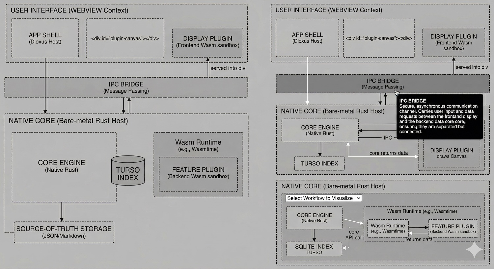

# Ensembly: Architecture Specification

## Core Philosophy
A "once-and-for-all" personal cataloging solution combining the structural power of a database, the data ownership of an offline-first file system, and the visual joy of a curated digital museum. The application is built on a **Rust Hybrid Engine**, utilizing an Obsidian-style Extensible Software Architecture where the app is a lightweight host and all major features and custom views are isolated plugins.

---

## 1. Tech Stack Overview

The application utilizes a single unified Rust codebase, compiling to native binaries across desktop and mobile platforms, while leveraging web technologies for flexible UI rendering and a highly secure WebAssembly (Wasm) plugin ecosystem.

* **Core Application (Native Layer):** Bare-metal **Rust**.
* **Presentation Shell (UI Layer):** **Dioxus** + Native OS WebView.
* **Database (The Index):** **Turso** (Pure Rust, SQLite-compatible with native Vector Search).
* **Plugin Ecosystem:** Rust compiled to **WebAssembly (.wasm)**.
* **Wasm Runtime:** **Wasmtime** (or similar) embedded in the native core.

---

## 2. Storage Philosophy (The Hybrid Storage Model)

The app separates the "Source of Truth" from the querying engine to ensure future-proof data ownership and instant startup times.

* **Source of Truth (Local Files):** Every item is saved as a discrete, human-readable file (JSON or Markdown with YAML frontmatter) alongside its local media assets. This guarantees total data ownership.
* **The Query Engine (Turso Index):** A hidden, persistent local database. Turso provides native Rust safety, standard SQLite file compatibility, Async I/O, and built-in vector search for AI-driven natural language queries (e.g., *"Show me sci-fi books I haven't read"*).
* **Smart Boot:** On startup, the Core Engine compares file `last_modified` timestamps against the Turso database, updating only changed rows.
* **The Escape Hatch:** The Turso index can be wiped and completely rebuilt from the local source files at any time.

---

## 3. System Architecture Layers

### Layer 1: The Native Core (The Host)
The foundational backend running directly on the machine's architecture (x86/ARM).
* Manages file system reads/writes.
* Maintains and queries the Turso database.
* Hosts the Backend Wasm Sandbox (Feature Plugins).
* Exposes a strict API for plugins.
* Manages the **IPC Bridge** (Inter-Process Communication) to route data securely to the frontend.

### Layer 2: The Presentation Shell (Dioxus Host)
The main window the user interacts with. Dioxus spins up a lightweight, native WebView and manipulates the UI using standard CSS styling driven by native Rust speeds.
* Draws the "App Shell" (Sidebar, top toolbars, settings menus).
* Renders the default "Archivist Mode" (dense, editable spreadsheet grids).
* Provides a blank `
` mounting point for custom UI plugins.

---

## 4. The Plugin Ecosystem (The Wasm Swarm)

Community developers write extensions in Rust and compile them to `.wasm` binaries. To ensure high performance and strict security, plugins are split into two distinct operational zones:

### Feature Plugins (Backend Sandbox)
* **Role:** Headless data processors (e.g., Global Search, ISBN API Lookup, AI Auto-Tagging).
* **Execution:** Run inside the Native Core using the embedded **Wasmtime** runtime.
* **Behavior:** Securely sandboxed. They process data, interact with the Core Engine API, and return results. They have no concept of a user interface.

### Display Plugins (Frontend Sandbox)
* **Role:** Custom "Full Canvas" visual interfaces (e.g., Gallery View, 3D Bookshelf, Interactive Timeline).
* **Execution:** The Core Engine serves these `.wasm` binaries directly into the Dioxus WebView environment.
* **Behavior:** They run inside the browser context, allowing them to utilize high-performance Web APIs (WebGL, Canvas) to draw fluid 60FPS interfaces directly into the `plugin-canvas` div without bottlenecking the Dioxus Virtual DOM.

---

## 5. Data Flow (Client-Server Local Model)

To avoid heavy string-passing (HTML/DOM generation) across memory boundaries, the app uses an asynchronous message-passing system via the IPC Bridge.

1.  **Interaction:** The user clicks an item inside a custom UI drawn by a Frontend Display Plugin.
2.  **Request:** The Display Plugin sends an event through the IPC Bridge to the Core Engine (e.g., *"Fetch metadata for Item #402"*).
3.  **Processing:** The Native Core queries the Turso database or local files.
4.  **Response:** The Native Core sends the JSON/Struct data back across the IPC Bridge.
5.  **Render:** The Display Plugin instantly repaints its own Canvas/WebGL screen using the new data.